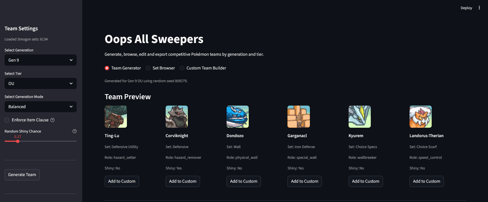
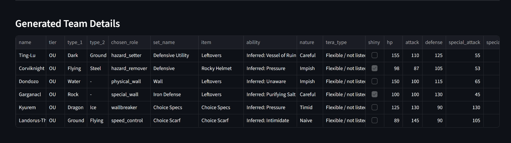
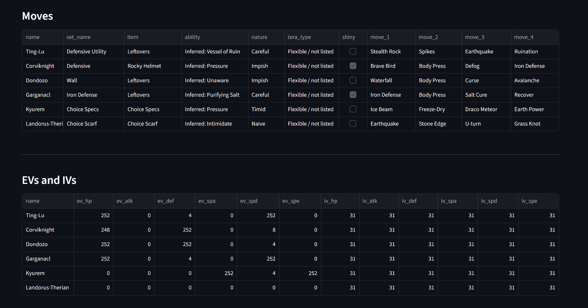
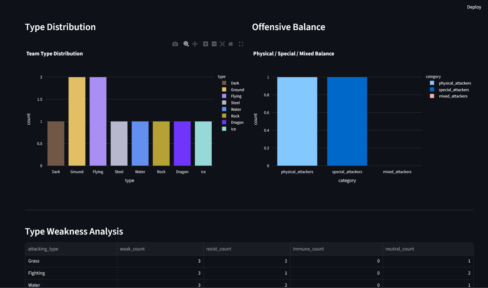
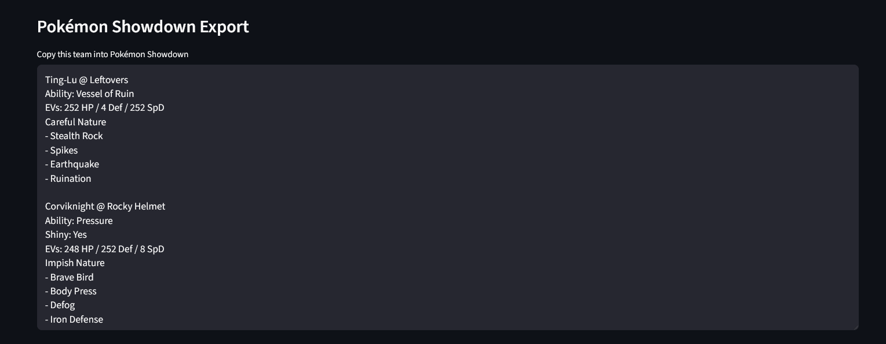

# Oops All Sweepers

**Oops All Sweepers** is an unofficial, fan-made Pokémon team builder and randomizer for competitive teambuilding.

This project started as a personal passion project around competitive Pokémon. I built it to combine something I enjoy with practical coding practice in Python, data processing, app development, UI design, packaging, and GitHub release management.

The app lets users generate, browse, edit, analyze, and export competitive Pokémon teams by generation and tier.

---

## Features

- Generate competitive Pokémon teams by generation and tier
- Browse Smogon-inspired movesets
- Add Pokémon from generated teams to a custom team
- Add selected sets from the Set Browser to a custom team
- Build and edit a custom team manually
- Edit moves, items, abilities, natures, Tera Types, EVs, IVs, and shiny status
- Analyze team roles, type distribution, offensive balance, and weaknesses
- Export teams directly to Pokémon Showdown format
- Uses Pokémon portraits from PMDCollab/SpriteCollab
- Includes update functionality for local data refreshes
- Packaged as a downloadable Windows app

---

## Screenshots

### Team Preview

The generated team is shown with portraits, set names, selected roles, and shiny status.



---

### Team Details

The app shows the selected Pokémon, generation, tier, types, roles, items, abilities, natures, Tera Types, shiny status, and base stats.



---

### Moves, EVs and IVs

Moves are displayed separately from EV and IV spreads to keep the team overview readable.



---

### Type Analysis

The app analyzes type distribution, offensive balance, shared weaknesses, resistances, and immunities.



---

### Pokémon Showdown Export

Generated and custom teams can be copied directly into Pokémon Showdown.



---

## Downloadable Windows App

A downloadable Windows version is available through the GitHub Releases page.

### How to run

1. Download `OopsAllSweepers_Windows.zip`.
2. Extract the full folder.
3. Open the extracted folder.
4. Double-click `OopsAllSweepers.exe`.

Do **not** move the `.exe` file out of the extracted folder. The executable depends on the internal files inside the same folder.

No Python, VS Code, Streamlit, or package installation is needed for the Windows release.

Windows SmartScreen may show a warning because the app is not code-signed.

---

## Running from Source

If you want to run the source code instead of using the Windows release:

```bash
git clone https://github.com/lukerodermond-bep/oops-all-sweepers.git
cd oops-all-sweepers
pip install -r requirements.txt
streamlit run app.py
```

The app should open in your browser automatically.

If it does not open automatically, check the terminal for the local URL, usually:

```text
http://localhost:8501
```

---

## Requirements

The app uses the following main Python packages:

```text
streamlit
pandas
plotly
requests
pyinstaller
```

These are listed in `requirements.txt`.

---

## Main App Sections

### Team Generator

The Team Generator creates a full team based on the selected generation, tier, and team style.

The user can select:

- Generation
- Tier
- Team generation mode
- Optional Item Clause
- Random shiny chance

The generator then creates a team using available Smogon-inspired sets from the correct generation and tier.

Generated Pokémon can also be added directly to the custom team.

---

### Set Browser

The Set Browser allows users to inspect available sets by:

- Role
- Pokémon
- Set name

For each set, the app shows:

- Item
- Ability
- Nature
- Tera Type
- Moves
- EVs
- IVs
- Roles

Selected sets can be added directly to the custom team.

---

### Custom Team Builder

The Custom Team Builder allows users to create and edit their own team.

Users can:

- Add Pokémon from generated teams
- Add Pokémon from the Set Browser
- Remove Pokémon
- Clear the full team
- Manually edit team members
- Analyze the custom team
- Export the custom team to Pokémon Showdown

---

## Team Generation Logic

The app is generation-aware. This means that generated teams use sets that match the selected generation and tier.

For example, the app avoids giving older-generation Pokémon sets with modern mechanics or items that did not exist in that generation.

Examples:

- Gen 3 Pokémon should not receive modern items such as Heavy-Duty Boots.
- Gen 3 Salamence should not receive Salamencite.
- Gen 1 and Gen 2 teams are treated differently because abilities, natures, and modern EV mechanics did not exist yet.
- Tera Types are only relevant from Gen 9 onward.

This helps prevent obvious cross-generation mistakes.

---

## Role System

The app uses roles to understand what a Pokémon or set is supposed to do.

Examples of roles include:

- hazard_setter
- hazard_remover
- physical_wall
- special_wall
- bulky_pivot
- defensive_pivot
- pivot
- wallbreaker
- physical_wallbreaker
- special_wallbreaker
- setup_sweeper
- speed_control
- revenge_killer
- cleaner
- weather_setter
- rain_setter
- sun_setter
- sand_setter
- snow_setter
- cleric
- support
- screen_setter
- phazer
- trapper
- status_spreader
- priority_user
- stallbreaker
- general_attacker

Roles are inferred from set data such as:

- Moves
- Items
- Abilities
- EV spreads
- Natures
- Set names

Role inference is useful, but it is not perfect. Some sets may receive broad or imperfect role labels.

---

## Team Analysis

The app includes several analysis sections.

### Average Speed and HP

The app calculates the team’s average Speed and HP.

These are simple indicators of team pace and bulk.

### Missing Required Roles

For role-based team generation modes, the app checks whether expected roles are present.

For Pure Random teams, missing roles are not enforced.

### Duplicate Items

The app detects duplicate held items.

Duplicate items are usually allowed in standard Smogon formats, but the app includes an optional Item Clause setting for users who want to avoid duplicate held items.

### Chosen Team Roles

The app shows the roles currently represented on the team, such as:

- hazard_setter
- hazard_remover
- wallbreaker
- speed_control
- physical_wall
- special_wall
- setup_sweeper
- pivot

Only the current chosen team roles are shown in this section to keep the overview readable.

### Type Distribution

The app counts the team’s Pokémon types and visualizes them in a chart.

### Offensive Balance

The app estimates whether the team has physical, special, or mixed attacking pressure.

### Type Weakness Analysis

The app checks each attacking type and counts how many team members are:

- weak to it
- resistant to it
- immune to it
- neutral to it

This helps identify shared weaknesses and defensive gaps.

---

## Pokémon Showdown Export

The app exports generated and custom teams in Pokémon Showdown-compatible format.

Example:

```text
Grimmsnarl @ Light Clay
Ability: Prankster
EVs: 248 HP / 180 Def / 80 SpD
Impish Nature
- Reflect
- Light Screen
- Taunt
- Play Rough
```

The app also includes ability inference for cases where the original set data does not explicitly list an obvious competitive ability.

For example:

- Grimmsnarl screens → Prankster
- Garganacl defensive sets → Purifying Salt
- Ditto → Imposter
- Gholdengo → Good as Gold
- Paradox Pokémon → Protosynthesis or Quark Drive

The table display may show inferred abilities as `Inferred: AbilityName`, while the Pokémon Showdown export uses the clean ability name directly.

---

## Data Sources

The app uses local data files and external data sources.

### Pokémon data

Stored in:

```text
data/pokemon_data.csv
```

Includes:

- Pokémon name
- Generation
- Tier
- Primary type
- Secondary type
- Roles
- HP
- Attack
- Defense
- Special Attack
- Special Defense
- Speed

### Moveset data

Stored in:

```text
data/pokemon_sets.csv
```

Includes Smogon-inspired set data such as:

- Pokémon
- Set name
- Format
- Generation
- Tier
- Roles
- Item
- Ability
- Nature
- Tera Type
- EVs
- IVs
- Moves

### Type chart

Stored in:

```text
data/type_chart.csv
```

Used for team weakness analysis.

### SpriteCollab credits

The local credits file can be stored in:

```text
data/spritebot_credits.txt
```

The official SpriteCollab credits file is available here:

```text
https://github.com/PMDCollab/SpriteCollab/blob/master/spritebot_credits.txt
```

---

## Data Update System

The app includes an **Update Data** option under advanced settings.

This can:

- Download the latest processed Smogon-style moveset data
- Rebuild the local Pokémon dataset
- Download the latest SpriteCollab credits file
- Clear and refresh the app cache

The update may take a few minutes.

---

## Project Structure

```text
oops-all-sweepers/
├── app.py
├── launcher.py
├── requirements.txt
├── README.md
├── THIRD_PARTY_NOTICES.md
├── .gitignore
│
├── data/
│   ├── pokemon_data.csv
│   ├── pokemon_sets.csv
│   ├── type_chart.csv
│   └── spritebot_credits.txt
│
├── screenshots/
│   ├── team_preview.png
│   ├── team_details.png
│   ├── moves_eviv.png
│   ├── type_analysis.png
│   └── smogon_export.png
│
└── src/
    ├── ability_utils.py
    ├── build_pokemon_data.py
    ├── data_loader.py
    ├── fetch_smogon_sets.py
    ├── path_utils.py
    ├── portrait_utils.py
    ├── set_loader.py
    ├── showdown_exporter.py
    ├── team_generator.py
    ├── type_analysis.py
    └── update_data.py
```

---

## Important Files

### `app.py`

Main Streamlit application.

Contains:

- Sidebar settings
- Navigation
- Team Generator page
- Set Browser page
- Custom Team Builder page
- Manual editor
- Analysis display
- Credits and disclaimer

### `launcher.py`

Used for the packaged Windows app.

It starts the Streamlit app locally and opens it in the browser.

It also searches for a free local port if the default port is already in use.

### `src/team_generator.py`

Contains:

- Team templates
- Random team generation
- Role-based team generation
- Set attachment logic
- Shiny logic
- Duplicate item detection

### `src/fetch_smogon_sets.py`

Downloads and converts moveset data.

Also infers roles from moves, items, abilities, natures, EVs, and set names.

### `src/build_pokemon_data.py`

Builds the local Pokémon dataset used by the app.

### `src/type_analysis.py`

Handles:

- Type distribution
- Offensive balance
- Type weakness analysis
- Weakness feedback
- Team summary

### `src/showdown_exporter.py`

Exports generated and custom teams to Pokémon Showdown-compatible text.

### `src/portrait_utils.py`

Builds PMDCollab/SpriteCollab portrait URLs, including support for shiny portraits and alternate forms.

### `src/ability_utils.py`

Handles ability inference for cases where set data leaves obvious abilities blank.

### `src/path_utils.py`

Handles file paths for both development and packaged app environments.

This is important because files are stored differently when the app is packaged with PyInstaller.

### `src/update_data.py`

Runs the data update process.

---

## Building the Windows App

The Windows app is built with PyInstaller.

Before building, make sure the app works locally:

```bash
streamlit run app.py
```

Then build from the project root:

```powershell
pyinstaller --onedir --name OopsAllSweepers --collect-all streamlit --copy-metadata streamlit --collect-all altair --collect-all pyarrow --add-data "app.py;." --add-data "src;src" --add-data "data;data" launcher.py
```

The output will be created in:

```text
dist/OopsAllSweepers/
```

To test the build:

```powershell
cd dist/OopsAllSweepers
.\OopsAllSweepers.exe
```

To distribute the app, zip the full folder:

```text
dist/OopsAllSweepers/
```

Do not distribute only the `.exe`.

Recommended release file name:

```text
OopsAllSweepers_Windows.zip
```

---

## Files Not Included in GitHub

These files and folders should not be committed to GitHub:

```text
build/
dist/
*.spec
__pycache__/
*.pyc
.venv/
venv/
.env
.streamlit/
```

The GitHub repository should contain the source code and data files needed to run the app, not the generated PyInstaller build folders.

The downloadable app should be attached separately as a GitHub Release.

---

## Known Limitations

- This is an unofficial fan-made project.
- Generated teams may still need human competitive judgment.
- Role inference is helpful but not perfect.
- Some set data may be incomplete if the source data leaves fields blank.
- Some older generations have different mechanics, so not every modern field applies.
- Some forms may require special portrait handling.
- The Windows app may trigger a SmartScreen warning because it is not code-signed.
- The app runs locally in a browser, even when launched through the `.exe`.

---

## Future Improvements

Possible future additions:

- Move, ability, and nature explanation panels
- Import teams from Pokémon Showdown text
- Save and load custom teams
- Drag-and-drop team ordering
- Better legality checks by generation
- More detailed matchup analysis
- Better role inference
- Installer instead of zipped folder
- Code signing for Windows releases

---

## Credits and Disclaimer

This is an unofficial, non-commercial, fan-made project.

For a more detailed overview of third-party assets, data sources, and software libraries used in this project, see [`THIRD_PARTY_NOTICES.md`](THIRD_PARTY_NOTICES.md).

### Pokémon intellectual property

Pokémon, Pokémon names, moves, items, types, mechanics, and related assets are trademarks or intellectual property of Nintendo, Game Freak, and The Pokémon Company.

This project does not claim ownership of any Pokémon intellectual property.

### PMDCollab / SpriteCollab portraits

Pokémon portraits are sourced from PMDCollab/SpriteCollab.

Full artist attribution is available in the official SpriteCollab credits file:

```text
https://github.com/PMDCollab/SpriteCollab/blob/master/spritebot_credits.txt
```

Full credit belongs to the original SpriteCollab artists and contributors.

This project does not claim ownership of any SpriteCollab portraits.

### Smogon-style moveset data

Moveset data is based on processed Smogon-style set data.

This project does not claim ownership of Smogon sets, analyses, competitive formats, or related data.

### Pokémon Showdown compatibility

Pokémon Showdown export formatting is included only for compatibility with Pokémon Showdown team import.

This project is not affiliated with Pokémon Showdown.

### Open-source software

This project is built with:

- Streamlit
- pandas
- Plotly
- requests
- PyInstaller
- Altair
- PyArrow

All third-party libraries remain under their own licenses.

### General disclaimer

Oops All Sweepers is not affiliated with, endorsed by, sponsored by, or officially connected to:

- Nintendo
- Game Freak
- The Pokémon Company
- Smogon
- Pokémon Showdown
- PMDCollab
- SpriteCollab
- pkmn

---

## License / Usage Note

This project is intended as an unofficial, non-commercial fan project and portfolio project.

The source code may be shared for educational and portfolio purposes.

External Pokémon-related names, data, portraits, sprites, moves, items, types, mechanics, and trademarks belong to their respective owners.

If you reuse or share this project, keep the credits and disclaimer sections intact.
